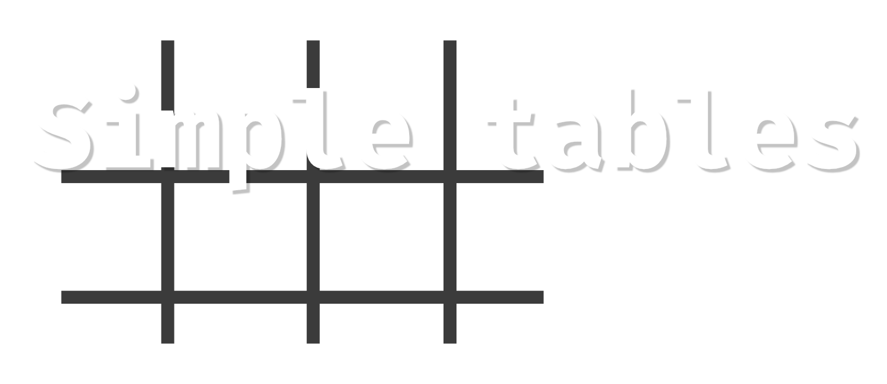

Simple Tables is a rust crate for easily creating table structures. This is made easy using macros.

## Table of Contents

- [Overview](#overview)
  - [Creating tables](#creating-tables)
  - [Functions](#functions)
    - [ToString](#tostring)
    - [Creating a new table instance](#creating-a-new-table-instance)
    - [Get rows](#get-rows)
    - [Get columns](#get-columns)
    - [Inserting rows](#inserting-rows)
    - [Column and row count](#column-and-row-count)
  - [Tables with UID's](#tables-with-uids)
    - [Getting a row based on the uid](#getting-a-row-based-on-the-uid)
- [Installing](#installing)
- [Contributing](#contributing)
- [Documentation](#documentation)
- [License](#license)

## Overview
### Creating tables
To create a table, you use the macros `table_row` to indicate the structure of a row and `table` to use a struct as a 
table for that row.

**Example**
```rust
use simple_tables::macros::{table_row, table};

#[table_row]
struct MyTableRow {
  id: u32,
  name: String,
  email: String,
  address: String
}

#[table(rows = MyTableRow)]
struct MyTable {}
```

These macros will implement the `TableRow` and `Table` trait respectively. You could also implement these manually.

### Functions
The traits `TableRow` and `Table` define a collection a functions, most of them with default implementations. Using the
`table_row` and `table` macros will implement these traits and their respective functions for the struct you are targetting.
The macros also provide some additional functions.

#### ToString
The macros also implement the `ToString` trait for tables, so you can use the `to_string` function.

**Example**
```rust
use simple_tables::Table;

let rows: Vec<MyTableRow> = vec![
  MyTableRow{ id: 0, name: "David Bowie".to_string(), email: "david@bowie.com".to_string(), address: "England".to_string()},
  MyTableRow{ id: 1, name: "David Gilmour".to_string(), email: "david@gilmour.com".to_string(), address: "England".to_string()},
  MyTableRow{ id: 2, name: "Opeth".to_string(), email: "info@opeth.com".to_string(), address: "Sweden".to_string()},
  MyTableRow{ id: 3, name: "The Beatles".to_string(), email: "info@beatles.com".to_string(), address: "England".to_string()}
];

let table = MyTable::from_vec(&rows);
let s = table.to_string();
println!("{}", s);
```

The output will be:
```
+----+---------------+-------------------+---------+
| id | name          | email             | address |
+====+===============+===================+=========+
| 0  | David Bowie   | david@bowie.com   | England |
+----+---------------+-------------------+---------+
| 1  | David Gilmour | david@gilmour.com | England |
+----+---------------+-------------------+---------+
| 2  | Opeth         | info@opeth.com    | Sweden  |
+----+---------------+-------------------+---------+
| 3  | The Beatles   | info@beatles.com  | England |
+----+---------------+-------------------+---------+
```

#### Creating a new table instance
```rust
let empty_table = MyTable::new();
let populated_table = MyTable::from_vec(&vec);
```

#### Get rows
You can either get the rows directly using `table.rows` or using one of the getters: 
- `table.get_rows()`
- `table.get_rows_mut()`
- `table.get_row_at(index)`

#### Get columns
You can get all values of a column using the `get_column` function. This function takes in a closure to get the value
of each entry.

**Example**
```rust
#[table_row]
struct MyTableRow2 {
  id: u32,
  name: String
}

#[table(rows = TableRow)]
struct MyTable2 {}
 
let vec: Vec<MyTableRow2> = vec![
  MyTableRow2{id: 1, name: String::from("Metallica")}, 
  MyTableRow2{id: 2, name: String::from("Slipknot")}
];
let table2 = MyTable2::from_vec(&vec);
let ids: Vec<u32> = table2.get_column(|row| row.id); // The function takes in a closure
assert_eq!(vec![1,2], ids);
```

#### Inserting rows

**Examples**
```rust
let row = MyTableRow { id: 4, name: "Pink Floyd", email: "pink@floyd.com", address: "England"};
// Appending the row to the end of the table
table.push(row);
// Inserting a row at the top of the table
table.insert_top(row);
// Inserting a row in the second position 
table.insert(2, row);
```

#### Column and row count
You can get the amount of columns using the `column_count()` function on your table. You can also get the amount of rows
using the `row_count()`.

### Tables with UID's
We can specify a table with a unique identifier. The following example shows how to do this:

```rust
use simple_tables::IdTable;

#[table_row]
struct MyTableRow {
  id: u32,
  name: String
}

// Insert the field's name in the `uid` section
#[table(rows = MyTableRow, uid = "id")]
struct MyTable {}

// When you need a table with rows containing uid's, you will have to manually implement the 
// `get_id_from_row` function
// The `IdTable` takes in 2 type parameters, one for the id's type and one for the rows's type
impl IdTable<u32, MyTableRow> for MyTable {
  // This function will simply return the id field from the row
  fn get_id_from_row(row: &MyTableRow) -> u32 { 
    row.id 
  }
}
```

**NOTE**: If your IDE complains saying `the trait bound MyTable: Table<MyTableRow> is not satisfied`, you can simply 
ignore this. The `Table` trait is implemented in the `table` macro, but your IDE just doesn't know this.

#### Getting a row based on the uid

You can get a row that matches the uid using the `get_row()` function.

**Example**
```rust
let vec = vec![ 
  MyTableRow { id: 1, name: "Jimmy Page".to_string() }, 
  MyTableRow { id: 2, name: "Slayer".to_string() }, 
  MyTableRow { id: 3, name: "MGMT".to_string() } 
];

let table = MyTable::from_vec(&vec);
let table_row = table.get_row(2).unwrap();

assert_eq!(vec[1], table_row.clone());
```

## Installing
Simply add the crate to your `cargo.toml`.

(This crate has not been published yet, please wait for a few minutes...)

```toml
[dependencies]
simple_tables = "0.0.1"
```


## Contributing
Contributions and suggestions are always welcome. 

If you know how to improve the crate just let me know.

You can also claim one of the issues in the issues tab.

## Documentation
The documentation can be found [here](#coming-soon).

## License
This crate is licensed under the MIT License. Details in the [LICENSE](LICENSE) file.
